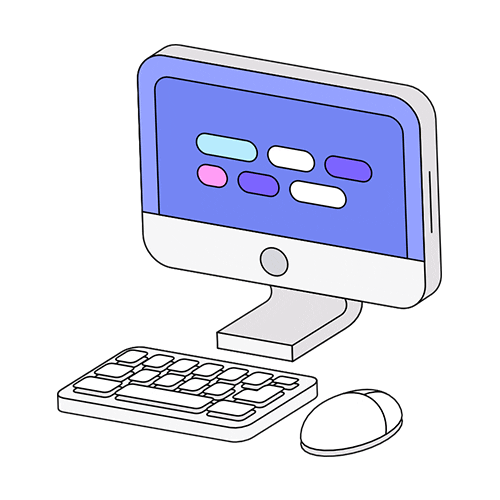

<!-- ══════════════════════════════ HEADER ══════════════════════════════ -->
<a href="https://chaithanya04.netlify.app">
  
</a>

<div align="center">


<p>
<a href="https://www.linkedin.com/in/chaithanya04"></a>
<a href="https://chaithanya04.netlify.app"></a>
<a href="mailto:ponnekantichaithanya0414@gmail.com"></a>
<a href="https://github.com/Chaithanya-0414"></a>
<a href="chaithu.pdf"></a>
</p>


&nbsp;


</div>


<!-- ══════════════════════════════ ABOUT ══════════════════════════════ -->
## `>` whoami 

I'm an **AI Engineer** who lives at the seam between **research and production** — where a clever model has to become a reliable, observable, shippable service. I build **LLM applications, multi-agent systems, and RAG pipelines**, and I wrap them in clean **FastAPI** backends that don't fall over in the real world.

```python
class Chaithanya:
    role        = "AI Engineer"
    company     = "Sydon AI"
    focus       = ["LLM apps", "AI agents", "RAG", "production GenAI"]
    stack       = ["Python", "FastAPI", "React", "LangGraph"]
    learning    = ["MLOps", "GenAI architecture", "eval-driven dev"]
    mission     = "Ship AI that survives contact with production."
    open_to     = "AI / ML Engineering roles"
```

- 🤖 &nbsp;Building **AI agents, LLM applications & production GenAI systems**
- ⚡ &nbsp;Designing **backend services and APIs** with FastAPI
- 🧠 &nbsp;Exploring **multi-agent orchestration** and **retrieval-augmented generation**
- 🎯 &nbsp;Next stop: **Production GenAI Engineer**
- 📫 &nbsp;Reach me → **ponnekantichaithanya0414@gmail.com**


<!-- ══════════════════════════════ STACK ══════════════════════════════ -->
## 🛠 &nbsp;Arsenal

<div align="center">

**Languages & Core**


**AI / ML & Backend**


</div>

| Domain | Tools |
|---|---|
| **AI Engineering** | LLM Apps · AI Agents · RAG Pipelines · Prompt Engineering · LangGraph |
| **Machine Learning** | Scikit-learn · Pandas · NumPy · OpenCV · Matplotlib · Seaborn |
| **Backend & APIs** | FastAPI · REST · Streamlit · Model Serving |
| **Data & Viz** | SQL · Power BI · Chart.js |
| **Craft** | Analytical thinking · Problem solving · Stakeholder comms · Collaboration |


<!-- ══════════════════════════════ PROJECTS ══════════════════════════════ -->
## 📊 &nbsp;Featured Work 

| 🚀 Project | 🧩 Stack | ✨ What it does |
|---|---|---|
| **AI Financial ERP Platform** | FastAPI · React · AI Agents · LLM | End-to-end finance platform driven by autonomous AI agents |
| **Medical Imaging Tumor Detection** | Python · ML · Computer Vision · Streamlit | CV pipeline that flags tumors from medical scans |
| **EcoBin-X — Smart Waste** | IoT · Sensors · Python | Sensor-driven waste monitoring & routing |
| **University Analytics Dashboard** | JavaScript · Chart.js · AI Scoring | Interactive analytics with AI-based scoring |
| **TN Political Analytics Dashboard** | Analytics · Data Viz | Data storytelling over political datasets |
| **Multilingual AI Translator** | Python · NLP · Streamlit | Real-time multilingual translation app |

<div align="center">

[**➥ &nbsp;Explore all repositories ⟶**](https://github.com/Chaithanya-0414?tab=repositories)

</div>


<!-- ══════════════════════════════ EXPERIENCE ══════════════════════════════ -->
## 💼 &nbsp;Experience 

**🟠 &nbsp;Junior AI Engineer** — *Sydon AI*
> Building AI-powered applications, AI agents, LLM workflows, FastAPI backends & production AI systems.

**🟠 &nbsp;Machine Learning with Python** — *Embrizon Technologies*
> Machine learning, Python, Scikit-learn, model development.

**🟠 &nbsp;Samsung Innovation Campus**
> Coding & programming fundamentals.

**🟠 &nbsp;Industrial Training, Inspection Team** — *RANE*
> Quality inspection & manufacturing process improvement.


<!-- ══════════════════════════════ EDUCATION ══════════════════════════════ -->
## 🎓 &nbsp;Education 

**🟠 &nbsp;B.Tech — Computer Science & Engineering** · *Bharath University* — **CGPA 8.10 / 10**

**🟠 &nbsp;Diploma — Engineering** · *KITS Institute of Technology & Science*

**🟠 &nbsp;Secondary Education** · *Sri Chaitanya e-Techno School*


<!-- ══════════════════════════════ STATS ══════════════════════════════ -->
## 📈 &nbsp;GitHub Analytics

<div align="center">


<!-- Snake animation — needs the GitHub Action below to render -->


</div>


<!-- ══════════════════════════════ FOOTER ══════════════════════════════ -->
<div align="center">

 &nbsp;**Let's connect, collaborate & build impactful AI together** &nbsp;

> *"Ship AI that survives contact with production."*

⭐ &nbsp;If my work resonates, drop a star — it genuinely helps.


</div>